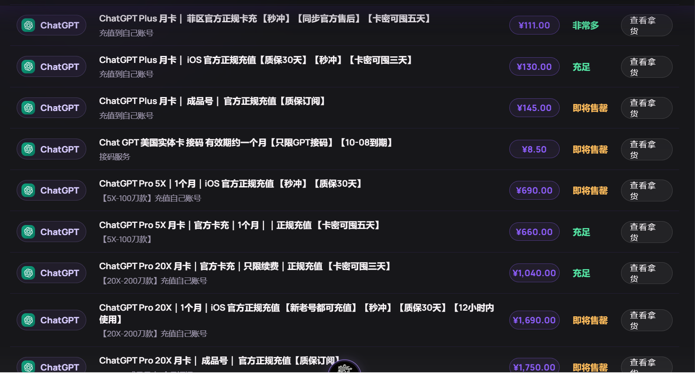
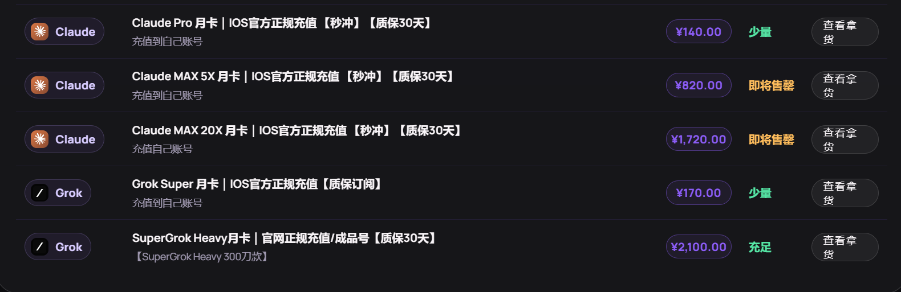

# ai代充计划

## 关键词
- 短视频平台引流
- 视频内容
- 代充实操
- 用户群体
- 价格运营，话术策略
- 售后服务

## 灵感（inspiration）
- **拼车服务可以解决新手用户不敢尝试的痛点，还可以收溢价**
- **透明化操作（是官冲的巨大优势）**

## 用户群体

### 用户群像

- 大多数20~30岁，男女都有
- 小白居多

### 专业用户
- **大学生**
- **科研人员**
- **论文作者**
- **it工作者**
- **自媒体工作者（文案编写）（ai剪辑）**  
《自媒体人必备：用ChatGPT一天量产10篇爆款文案》。
- 设计师（视频设计）
- 教师（出试卷）
- 产品经理  
《产品经理必备：ChatGPT帮你写出让开发无法反驳的PRD》。
- **跨境电商商家**
- 其他专业用户
### 新手用户
- 想尝鲜
- 害怕被淘汰
- 轻度使用者、一次性使用者（拼车）
- **希望用ai创业的新手玩家**
- 与噱头相关

## 视频内容

### 注意事项

### 视频平台
| 平台     | 限制                   |
| -------- | ---------------------- |
| bilibili | 视频号        相对宽松 |
| 抖音     | 容易限流，偷偷屏蔽评论 |
| 小红书   | 流量较高，限制较少     |
| 咸鱼     |
| 淘宝     |
| 贴吧     |
| csdn     |
| 知乎     |
| 推特     |
| 竞赛论坛 |
**（还可联想用户群体中其他群体的强相关平台）**
- 以上平台对应的各大评论区

### 视频内容类型（需要具体一些）
#### 针对性强，流量弱的类型 （针对专业用户）
1. 宣传举例ai的强作用大学生用户（竞赛，科研，论文写作）

2. 确定有哪些大学生竞赛

#### 针对性弱，流量强的类型 （针对新手）
1. 以蹭流量为主，主要依赖于平台的流量和用户群体。
偏向娱乐化

2. 以引发争议为主，制造矛盾，引发焦虑获取流量

### 视频内容分配（待定）

---

##  决策 话术

### 决策

#### 如何找客户：对应视频内容和用户群体相关内容

#### 如何让顾客首次购买的关键
> **?核心：解决问题，提供价值； 强调专业，获取信任；强调售后，消除焦虑；强调优惠，拉踩差距**
- 以ai可以做什么为切入点，展示ai的能力和价值。  （ai教程）
举例：《ChatGPT写本科论文全流程，一天搞定初稿》
- 降低门槛：强调只需要给钱，其他都交给我，搭载外网，安装，注册一条龙。
- 第一次购买，强调优惠，拉踩差距。
- 明确订阅质保范围与不保事项，避免“封号包赔”等超范围承诺；用透明规则和售后响应消除顾客焦虑。
- 联想其他产业，如代安装软件顺带销售。

#### 如何让顾客重复购买的关键
##### **核心：搭载私域社区（新手拼车）；订阅到期主动提示；展示专业服务（响应速度，透明化操作）；持续内容输出；复购优惠服务；关系锁定**

## 价格与售后

### 内部商品信息（请勿对外）

<strong>展开查看售价与内部备注</strong>

| 品类    | 子品类                       | 售价 | 内部备注                                                      |
| ------- | ---------------------------- | ---: | ------------------------------------------------------------- |
| ChatGPT | Plus 月卡·菲区卡充           |  129 | 入门性价比；仅免费版/无订阅个人号；不可覆盖；30 天订阅保障    |
| ChatGPT | Plus 月卡·iOS 充值           |  149 | 可覆盖原 Plus，但时长不叠加；不可覆盖 Pro；30 天订阅保障      |
| ChatGPT | Plus 月卡·成品号             |  179 | 人工制作约 10 分钟至 2 小时；30 天订阅保障                    |
| ChatGPT | Pro 5X·卡充                  |  699 | 仅正常无订阅个人号；不可覆盖；30 天订阅保障                   |
| ChatGPT | Pro 5X·iOS 充值              |  729 | 可覆盖 iOS Plus；覆盖后从当天重算；30 天订阅保障              |
| ChatGPT | Pro 20X·菲区卡充             | 1099 | 仅限 Pro 20X 续费；接单前须人工核验                           |
| ChatGPT | Pro 20X·iOS 充值             | 1799 | 新老号可充；可覆盖 iOS Plus；30 天订阅保障                    |
| ChatGPT | Pro 20X·成品号               | 1849 | 人工制作约 10 分钟至 2 小时；30 天订阅保障                    |
| Claude  | Pro 月卡·iOS 充值            |  169 | 须等会员到期且无逾期账单；30 天订阅保障                       |
| Claude  | Max 5X 月卡·iOS 充值         |  699 | 须等会员到期且账单正常；可能触发 KYC；30 天订阅保障           |
| Claude  | Max 20X 月卡·iOS 充值        | 1799 | 重度档；须等会员到期且账单正常；30 天订阅保障；下单前确认库存 |
| Grok    | Super 月卡·印度区 iOS        |  199 | 可提前续费但会覆盖剩余时长；订阅期保障                        |
| Grok    | SuperGrok Heavy·充值自有账号 | 2199 | 300 美元档；联系人工现场制作；30 天订阅保障                   |
| Grok    | SuperGrok Heavy·成品号       | 2199 | 300 美元档；人工制作并交付新账号                              |

#### 上游价格截图（仅供内部核对）

---

<!-- 客户展示区开始：建议从下一行标题开始截图 -->

## AI 会员月卡 · 服务价目表

- **正规订阅渠道 · 到账可在官方账号核验 · 表内标注套餐享订阅保障**

- 本店坚持**透明化**操作，**让用户以最低的价格得到最稳定的服务**：  
 **售前：客服**提供免费选型指导   
 **售中：用户**在官方网页获取session（无需向客服提供账号隐私），**客服**确认套餐和session后秒充秒到账   
 **售后：** 充值前后有任何问题 **客服保证负责到底**

- **本店提供一对一选型与基础指导，以下内容建议有任何看不懂的都可联系客服咨询**

- **快速选择：轻度使用、日常问答、写作和学习选Plus；基础额度经常不够再选 5X；只有明确的重度连续任务才建议 20X**  
  
  
  已有个人账号，且无订阅或订阅过期的用户，建议选择菲区卡充。  
已有个人账号，且订阅未过期的用户，建议选择iOS卡充。  
无个人账号或仅需要临时账号的用户，建议选择成品号。  
 
- **建议用户结合实际需求购买，不提倡过度追求高额度套餐。**

### ChatGPT

| 套餐                      |    服务价 | 适合人群 / 购买须知                                                                                        |
| ------------------------- | --------: | ---------------------------------------------------------------------------------------------------------- |
| **Plus ·$~~~~$菲区卡充**  |  **¥129** | 适合**已有**个人账号，且无订阅或订阅过期的用户；**不可覆盖** ；30 天订阅保障                               |
| **Plus · $~~~~$iOS 充值** |  **¥149** | 适合**已有**个人账号，额度用完但订阅未过期的用户；**可覆盖**原 Plus，时长重算、不叠加；30 天订阅保障       |
| **Plus · $~~~~$成品号**   |  **¥179** | 适合无可用账号或仅需要临时账号的用户；交付新账号，人工约 10 分钟至 2 小时；30 天订阅保障                   |
| **Pro 5X · 菲区卡充**     |  **¥699** | 适合高频使用，**已有**个人账号，且无订阅或订阅过期的用户；**不可覆盖** ；30 天订阅保障                     |
| **Pro 5X · iOS 充值**     |  **¥729** | 适合高频使用，**已有**账号的用户，额度用完但订阅未过期的用户；账号可覆盖 iOS Plus，时长重算；30 天订阅保障 |
| **Pro 20X · 菲区续费**    | **¥1099** | 适合重度连续任务；仅限 Pro 20X 续费，账号资格须在下单前人工核验；30 天订阅保障                             |
| **Pro 20X · iOS 充值**    | **¥1799** | 适合重度工作流；新老号可充；30 天订阅保障                                                                  |
| **Pro 20X · 成品号**      | **¥1849** | 适合无自有账号或需要临时账号的重度用户；交付新账号，人工制作；30 天订阅保障                                |

### Claude

| 套餐                   |    服务价 | 适合人群 / 购买须知                                                       |
| ---------------------- | --------: | ------------------------------------------------------------------------- |
| **Claude$~~~~$Pro**    |  **¥169** | 日常问答、写作与翻译；原会员须到期；30 天订阅保障                         |
| **Claude$~~~$ Max 5X** |  **¥699** | 高频长文本、方案与代码辅助；账单须正常；可能需 KYC；30 天订阅保障         |
| **Claude$~~$Max 20X**  | **¥1799** | 极重度长文档与连续任务；**轻度用户不建议**；30 天订阅保障；下单前确认库存 |

### Grok

| 套餐                                   |    服务价 | 适合人群 / 购买须知                                          |
| -------------------------------------- | --------: | ------------------------------------------------------------ |
| **Grok Super ·$~~~~~~~~~~$印度区 iOS** |  **¥199** | 安卓 / iOS 均可用；可提前续费但会覆盖剩余时长；30 天订阅保障 |
| **SuperGrok Heavy · 自有账号**         | **¥2199** | 明确需要 300 美元高用量档；联系人工现场充值；30 天订阅保障   |
| **SuperGrok Heavy · 成品号**           | **¥2199** | 无自有账号的重度用户；人工制作并交付新账号；30 天订阅保障    |

### 一站式协助

| 服务                     |  服务价 | 包含内容                                                 |
| ------------------------ | ------: | -------------------------------------------------------- |
| **客户端安装与基础调试** | **¥39** | 安装、登录与基础使用指导；不含会员及网络线路             |
| **协助注册**             | **¥19** | 正常注册流程协助；不含会员，是否可注册以平台实时规则为准 |

---

#### 下单总备注

1. **先核验、后下单：** 请先根据有无账号、账号状态、是否需要覆盖等信息，确认应选“新开（成品号）、覆盖（iOS）还是续费（菲区）”，避免买错渠道；
2. **覆盖不等于叠加：** 标注“可覆盖”的套餐会从充值成功当天重新计算，原有剩余时长通常不会累加；同档覆盖也不代表已使用额度会恢复。充值后请在对应平台账号的“设置 / 订阅”页面核对套餐名称与到期日。这是官方的覆盖规则，具体细则可在官网查询。
3. **质保仅限订阅：** “30 天订阅保障 / 订阅期保障”仅处理订阅异常掉落；账号封禁、异常使用环境、频繁切换地区、逾期账单、违规使用、KYC 或手机号验证等账号风控不在保障范围内。  
*属于订单保障范围的订阅异常，我们会持续跟进至处理完成；账号风控或封号也可联系客服协助核查并提供申诉指引，但审核与恢复结果由官方决定。*  
*总之请放心，我们的宗旨一向是“**让用户以最低的价格得到最稳定的服务**”
4. **成品号为新账号：** 成品号不是充值原账号；收到后请及时核对订阅状态，并修改可修改的安全信息。人工处理时间会随订单量变化。
5. **价格与库存会波动：** 表内均为人民币报价，会员套餐一般为 1 个月；上游库存和渠道价格可能调整，付款前以最终确认的信息为准。
6. **服务与品牌声明：** 本店为独立第三方充值与操作协助服务商，并非 OpenAI、Anthropic、xAI 等平台的官方网站、授权代理或关联机构；相关产品名称与商标归各自权利人所有。“正规订阅渠道”仅表示订阅最终可在对应平台账号内核验，不代表品牌方对本店授权、背书或合作。
7. **平台规则与服务边界：** 本店负责按付款前确认的套餐、渠道和交付方式完成服务，并处理订单约定范围内的订阅异常。套餐权益、使用额度、地区可用性、价格、风控和验证规则可能由官方平台调整，均以对应官方平台最新规则及账号内实际显示为准。
8. **账号责任与售后协助：** 客户应确保账号及所提供信息真实、合法、可正常使用，并遵守对应平台服务条款。因账号历史、异常订阅、使用环境、违规操作、KYC、手机号验证或平台独立审核造成的限制与封禁，不属于订阅保障；本店可协助核查订单并提供申诉指引，但无法干预平台审核或承诺账号恢复。
9. **合规使用倡议：** 我们希望每一个从本店购买或充值的账号，都能用于学习、工作、研究与内容创作等合法、正当用途。使用时请遵守所在地法律法规及对应平台服务条款，不得用于欺诈、侵权、骚扰、传播违法内容、绕过平台安全措施或其他违法违规活动；因不当使用产生的账号限制、损失或法律责任由使用者自行承担。

<!-- 客户展示区结束 -->

| 品类    | 子品类                       | 售价 | 备注                                                      |
| ------- | ---------------------------- | ---: | ------------------------------------------------------------- |
| ChatGPT | Plus 月卡·菲区卡充           |  129 | 入门性价比；仅免费版/无订阅个人号；不可覆盖；30 天订阅保障    |
| ChatGPT | Plus 月卡·iOS 充值           |  149 | 可覆盖原 Plus，但时长不叠加；不可覆盖 Pro；30 天订阅保障      |
| ChatGPT | Plus 月卡·成品号             |  179 | 人工制作约 10 分钟至 2 小时；30 天订阅保障                    |
| ChatGPT | Pro 5X·卡充                  |  699 | 仅正常无订阅个人号；不可覆盖；30 天订阅保障                   |
| ChatGPT | Pro 5X·iOS 充值              |  729 | 可覆盖 iOS Plus；覆盖后从当天重算；30 天订阅保障              |
| ChatGPT | Pro 20X·菲区卡充             | 1099 | 仅限 Pro 20X 续费；接单前须人工核验                           |
| ChatGPT | Pro 20X·iOS 充值             | 1799 | 新老号可充；可覆盖 iOS Plus；30 天订阅保障                    |
| ChatGPT | Pro 20X·成品号               | 1849 | 人工制作约 10 分钟至 2 小时；30 天订阅保障                    |
| Claude  | Pro 月卡·iOS 充值            |  169 | 须等会员到期且无逾期账单；30 天订阅保障                       |
| Claude  | Max 5X 月卡·iOS 充值         |  699 | 须等会员到期且账单正常；可能触发 KYC；30 天订阅保障           |
| Claude  | Max 20X 月卡·iOS 充值        | 1799 | 重度档；须等会员到期且账单正常；30 天订阅保障；下单前确认库存 |
| Grok    | Super 月卡·印度区 iOS        |  199 | 可提前续费但会覆盖剩余时长；订阅期保障                        |
| Grok    | SuperGrok Heavy·充值自有账号 | 2199 | 300 美元档；联系人工现场制作；30 天订阅保障                   |
| Grok    | SuperGrok Heavy·成品号       | 2199 | 300 美元档；人工制作并交付新账号                              |

